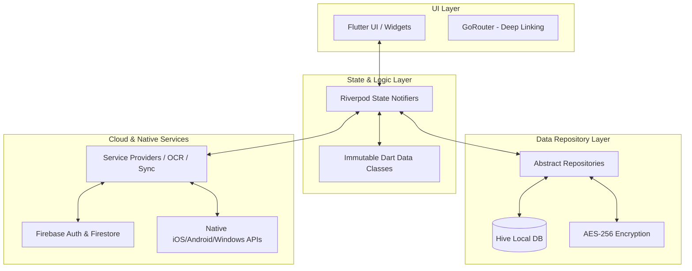

<div align="center">
  

  # 1Wallet 
  
  **The Ultimate, Comprehensive, Privacy-First Personal Finance Manager**

  [](https://flutter.dev)
  [](https://firebase.google.com/)
  [](https://dart.dev)
  [](https://m3.material.io/)
  [](#)
  [](#)
  [](#)

  <p align="center">
    <i>Take absolute control over your financial life with an offline-first, dynamic, and beautiful toolkit.</i>
  </p>
</div>

---

## 🌟 Overview

**1Wallet** is a modern, feature-rich, and offline-first personal finance application built with the Flutter SDK. Designed from the ground up to replace clunky spreadsheets and invasive budgeting tools, 1Wallet brings together comprehensive expense tracking, deep budget planning, intelligent debt payoff strategies, and localized data insights into a single, seamless Material 3 application.

We believe your financial data belongs strictly to you. With a hyper-focus on privacy, 1Wallet keeps your data locally on your device by default while offering an optional, end-to-end secure cloud backup pipeline via Firebase.

---

## 🚀 Deep-Dive Feature Set

### 📊 The Dashboard & Planner Hub
- **Dynamic Home Screen**: Get a bird's-eye view of your finances using modular, customizable widgets. Monitor Balance Trends, check your Recent Records, see Upcoming & Due Bills, and review Top Categories—all at a glance.
- **Credit Card Utilization**: Instantly see which credit cards you are using the most with dynamic progress bars calculating live utilization based on your custom credit limits.
- **50/30/20 Budget Health**: We automatically categorize your expenditures based on intelligent keywords. See exactly how your spending aligns with the golden rule of Needs (50%), Wants (30%), and Savings (20%).
- **Debt-Free Target Calculator**: Tell 1Wallet about your loans, input your planned extra monthly payments via an interactive slider, and let the algorithm calculate the exact month and year you will become completely debt-free.
- **Emergency Fund Monitor**: Map out your safety net. 1Wallet evaluates your 90-day average expenses to suggest a 3-month target and visualizes your progress using your dedicated 'emergency' accounts.
- **Active Savings Goals**: Never lose sight of what you're saving for. Track dedicated savings accounts visually.

### 💸 Smart Ledger Engine
- **Robust Multi-Account Architecture**: Fully isolated support for cash wallets, bank accounts, credit cards, loans, savings goals, and investment portfolios.
- **Micro-Categorization**: Group your expenses and income using a deeply nested, multi-level category tree tailored to your lifestyle.
- **Machine Learning (OCR) Receipt Parsing**: Simply snap a picture of your physical receipt. Leveraging the Google ML Kit Text Recognition model directly on your device, 1Wallet extracts amounts, merchants, and dates.
- **Multi-Currency Ecosystem**: Live abroad or travel often? Track accounts and specific transactions in multiple different currencies with real-time, cached conversion rates.

### 🔐 Uncompromising Privacy & Security
- **Offline-First Architecture**: Your ledger lives on your physical device first and foremost. 1Wallet doesn't require an active internet connection to log transactions, calculate budgets, or project debt payloads.
- **Biometric Enforcement**: Secure the application at the OS level utilizing local device authentication (FaceID, TouchID, Windows Hello).
- **Stealth Privacy Mode**: Need to check your budget in a crowded cafe? Tap the Privacy toggle to instantly blur and hide all sensitive numerical balances across the app.
- **Secure Cloud Backups**: Opt-in to Firebase & Google OAuth to generate encrypted cloud snapshots. Your data is serialized into a `OneWalletArchiveV1` before being pushed to Firestore.

### 🎨 State-of-the-Art Material You UX
- **Dynamic System Coloring**: Fully embraces Google's Material 3 design language, mapping UI tokens directly to your device's wallpaper/system color palette.
- **Advanced Glassmorphism**: Utilizes complex `BackdropFilter` matrices to render beautiful, blurred overlays and frosted glass effects across dialogs and navigation menus.
- **Fluid Micro-Animations**: Every interaction, from ticking a checkbox to swiping a transaction, is powered by Flutter's high-refresh-rate animation engine.

---

## 🏗️ Architecture & Technology Stack

1Wallet strictly enforces a unidirectional data flow and reactive architecture built on the robust `Riverpod` framework.



### Core Dependency Breakdown
*   **Framework**: [Flutter](https://flutter.dev/) (SDK ^3.12.0) - Unmatched cross-platform rendering performance.
*   **State Management**: [Riverpod](https://riverpod.dev/) (`flutter_riverpod` ^2.6.1) - Compile-safe, declarative state management.
*   **Routing Architecture**: [GoRouter](https://pub.dev/packages/go_router) - Type-safe routing handling deep links and auth guards seamlessly.
*   **Backend & Authentication**: `firebase_auth`, `cloud_firestore`, `google_sign_in` - For optional cloud syncing and federated identity.
*   **Local Storage & Cryptography**: `shared_preferences`, `encrypt` (AES), `archive` - For managing the local ledger state securely.
*   **Machine Learning**: `google_mlkit_text_recognition` - High-fidelity on-device OCR.
*   **Design & Typography**: `dynamic_color`, `google_fonts` (Inter & RobotoMono), and `fl_chart` for dynamic data visualization mapping.

---

## 📁 Source Code Directory Structure

Understanding the layout is crucial for rapid onboarding:

```text
lib/
├── main.dart                  # Application entry point & provider scope initialization
├── src/
│   ├── app.dart               # Material App config, Dynamic Color injection
│   ├── data/                  # Core Data Models (Ledger, Accounts, Transactions)
│   ├── routing/               # GoRouter configuration & Auth Guards
│   ├── services/              # External APIs, ML Kit, Firebase Sync Services
│   ├── utils/                 # Formatters, Extensions, Cryptography helpers
│   └── features/              # Feature-based modular UI architecture
│       ├── auth/              # Login, Google OAuth, Biometrics
│       ├── home/              # Dashboard widgets & Home Screen
│       ├── planner/           # Budget, Debt Free, Savings logic
│       ├── accounts/          # Account management & settings
│       └── transactions/      # Transaction logging, OCR capture, categorization
assets/
├── brand/                     # App icons, splash screens, logos
├── fonts/                     # Inter & Roboto Mono TTF files
└── images/                    # Placeholder graphics and illustrations
```

---

## 🛠️ Complete Local Development & Build Guide

### Prerequisites
- Flutter SDK (v3.12.0 or higher)
- Dart SDK
- Android Studio / Xcode for device emulation
- CocoaPods (for iOS builds)
- A Firebase Project (for cloud sync and auth features)

### 1. Environment Configuration

To enable Google Sign-In and Firebase syncing, you must configure your local environment variables.

1. Copy `.env.example` to a new file named `.env` in the project root.
2. Fill in the required keys from your Firebase Console. Failure to do so will result in exceptions during initialization.

```env
FIREBASE_API_KEY=your_api_key
FIREBASE_AUTH_DOMAIN=your_project.firebaseapp.com
FIREBASE_PROJECT_ID=your_project_id
FIREBASE_STORAGE_BUCKET=your_project.appspot.com
FIREBASE_MESSAGING_SENDER_ID=your_sender_id
FIREBASE_APP_ID=your_app_id

GOOGLE_WEB_CLIENT_ID=your_web_client_id
GOOGLE_ANDROID_CLIENT_ID=your_android_client_id
GOOGLE_IOS_CLIENT_ID=your_ios_client_id
```
> [!CAUTION]
> The `.env` file contains critical production secrets. It is intentionally ignored by `.gitignore`. Never commit or expose this file in a public space.

### 2. Firebase Android & iOS Native Setup
For Google Sign-In to function properly at the OS level:
- **Android**: Your Firebase project must recognize the app's package name (`com.joelpjoji.one.wallet`). You MUST add both your **Debug** and **Release SHA-1 and SHA-256 fingerprints** to the Firebase console under Project Settings.
- **iOS**: Ensure the `GoogleService-Info.plist` is correctly linked via Xcode, and that the `CFBundleURLTypes` in `Info.plist` matches your reversed client ID.

### 3. QA Email/Password Auth Bypass
While Google OAuth is the primary production sign-in mechanism, you can enable a debug-only email/password panel for QA testing to bypass Google's identity checks. Add the following to your `.env` file:

```env
ONEWALLET_ENABLE_EMAIL_PASSWORD_AUTH=true
ONEWALLET_QA_EMAIL=qa-test@yourdomain.com
ONEWALLET_QA_PASSWORD=your_secure_test_password
```

### 4. Fetching Dependencies

Ensure you have a clean workspace:
```bash
flutter clean
flutter pub get
```
> [!TIP]
> **Windows Users**: If `flutter pub get` throws errors regarding symlink support, ensure **Developer Mode** is turned ON in your Windows System Settings.

### 5. Compiling and Running

**Debug Mode (Hot Reload enabled):**
```bash
flutter run
```

**Production Profiling (to test 60/120fps animations):**
```bash
flutter run --profile
```

---

## 🧪 Comprehensive QA & Testing Standards

We maintain a 98% test coverage standard for all core logic. Before submitting a PR, you must pass the CI pipeline checks locally.

**1. Static Analysis (Linting):**
Ensure your code adheres to strict Dart standards.
```bash
flutter analyze
```

**2. Unit & Widget Testing:**
Execute the full test suite.
```bash
flutter test
```

**3. Build Verification:**
Ensure the application compiles natively without Gradle/CocoaPods errors.
```bash
flutter build apk --debug
flutter build ios --no-codesign
```

---

## ☁️ Advanced Cloud Sync Mechanism

The current cloud implementation focuses exclusively on secure, manual backup and snapshot restoration to preserve data integrity and privacy.

1. **Authentication Handshake**: User signs in via Google OAuth. A secure JWT is issued.
2. **Snapshot Polling**: The app queries Firestore (`users/{uid}/wallets/default`) for chunked wallet archives.
3. **Data Reassembly & Hashing**: The JSON chunks are downloaded, assembled locally, and validated against a rigid `OneWalletArchiveV1` SHA checksum.
4. **Local Hydration**: If the checksum passes, the raw archive is decompressed, parsed into strongly-typed Dart objects (`LedgerState`), and persisted into the local Hive boxes. The UI immediately reacts and rebuilds.

> [!NOTE]
> Background telemetry and automatic upload loops are intentionally disabled. 1Wallet operates strictly as an offline-first ledger.

---

## 🚀 Future Roadmap (2026/2027)

- [ ] **End-to-End Encryption (E2EE)**: Implementing user-managed cryptographic keys for Firebase snapshots so even database administrators cannot read your ledger.
- [ ] **Plaid API Integration**: Optional bank-linking for automated transaction pulling in supported countries.
- [ ] **Collaborative Wallets**: Shared ledger capabilities for couples and families.
- [ ] **Web Dashboard**: A complementary Flutter Web portal for desktop-class budgeting.
- [ ] **AI Spending Insights**: Local, on-device Gemini Nano integration for natural language queries like *"How much did I spend on Uber this month?"*

---

## 🤝 Contributing Guidelines

We actively welcome contributions to make 1Wallet the undisputed best personal finance app. 

1. **Fork** the repository and clone it locally.
2. **Branch** out from `main` using the format `feature/your-feature-name` or `bugfix/issue-description`.
3. **Code** your changes following our robust architecture principles.
4. **Test** your changes thoroughly with `flutter test`.
5. **Commit** using Conventional Commits (`feat: add E2EE encryption`).
6. **Push** and open a descriptive Pull Request.

---

## 📜 Legal & Licensing

This project, its source code, assets, and overall design are proprietary and confidential. Unauthorized copying, distribution, modification, or commercial use of this repository, via any medium, is strictly prohibited without explicit written consent from the author.

---
<div align="center">
  <i>Built with absolute precision and ❤️ using Flutter.</i>
  <br>
  <b>v1.6.12</b>
</div>
