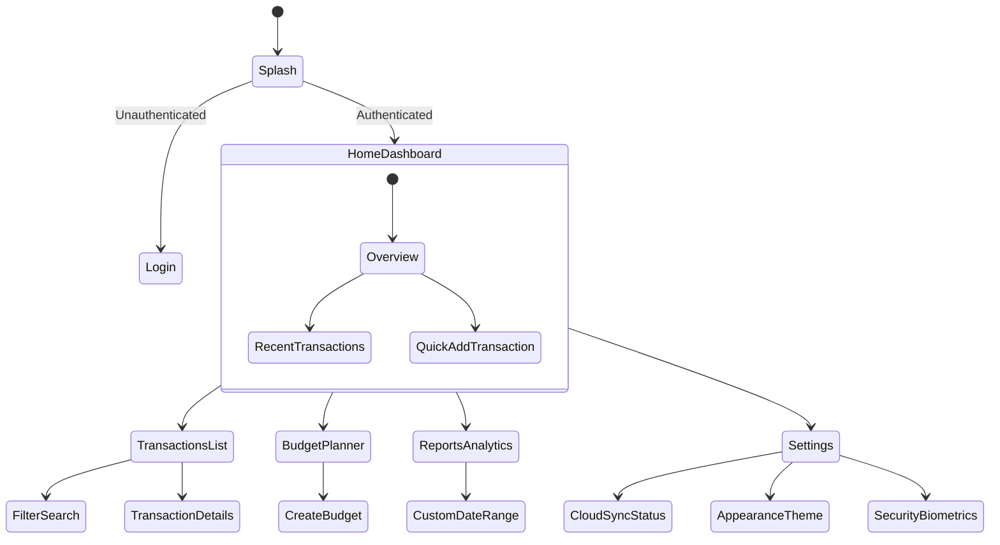
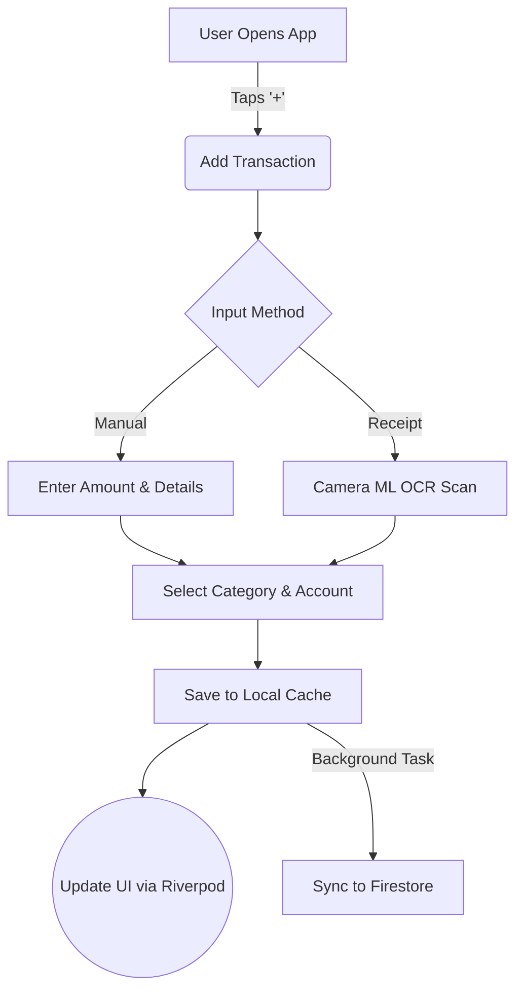
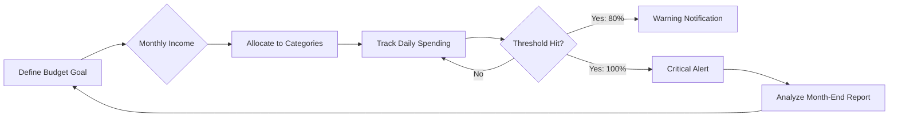
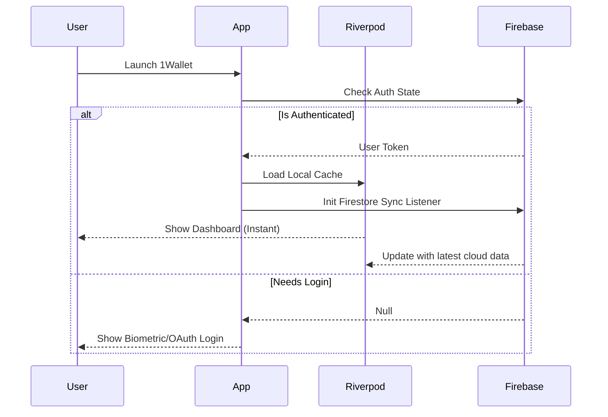
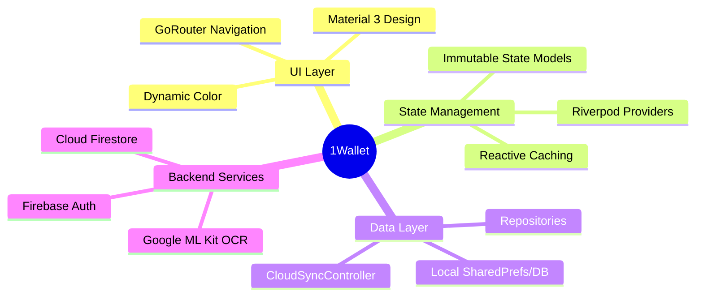

<div align="center">
  <!-- Animated Header -->
  
  
  <br/>
  
  
  
  <h1>💸 1Wallet 💸</h1>
  
  <p>
    <!-- Core Badges -->
    <a href="https://flutter.dev"></a>
    <a href="https://firebase.google.com/"></a>
    <a href="https://dart.dev"></a>
    <br/>
    <!-- Action Badges -->
    <a href="https://github.com/joelpjoji-mns/1wallet/actions"></a>
    <a href="https://github.com/joelpjoji-mns/1wallet"></a>
    <br/>
    <!-- Social Badges -->
    <a href="https://github.com/joelpjoji-mns/1wallet"></a>
    <a href="https://github.com/joelpjoji-mns/1wallet"></a>
    <a href="https://github.com/joelpjoji-mns/1wallet/issues"></a>
    <a href="https://github.com/joelpjoji-mns/1wallet/blob/main/LICENSE"></a>
  </p>
  
  
</div>

<br/>

## 🚀 The Definitive Digital Wallet Experience

**1Wallet** is a meticulously crafted, secure, and unified personal finance application built for the modern era. We've taken the complexity of tracking your money and transformed it into a buttery-smooth, deeply satisfying mobile experience.

<div align="center">
  
</div>

<br/>


## 🌟 Comprehensive Feature Suite

1Wallet isn't just an expense tracker; it's a full-fledged wealth management powerhouse. Here is exactly what it can do:

### 🧾 Smart Receipt Capture & OCR
Stop typing. Just take a picture. We use on-device **Google ML Kit Text Recognition** to scan your receipts, automatically extracting amounts, dates, and vendors to instantly categorize your spending.

### 💰 Intelligent Budgeting Engine
Set strict or flexible budgets for different categories. 
- **Envelope Budgeting**: Allocate funds and watch them deplete.
- **Smart Alerts**: Get notified when you hit 80% or 100% of your budget.
- **Rollover Options**: Roll over unused budget amounts to the next month.

### 💱 Global Currency & Conversion
Traveling or working with international clients?
- Supports 150+ global fiat currencies.
- Historical and real-time exchange rates.
- See your entire net worth unified into a single "Home" currency.

### 📈 Advanced Analytics & Reporting
Beautiful, interactive charts powered by **Fl_chart**. 
- **Income vs Expense** visual comparisons.
- **Category breakdown** donuts and pie charts.
- **Historical trends** over customizable date ranges.

### 🔄 Offline-First Cloud Sync Engine
Your data belongs to you, anywhere you are. Our synchronization layer leverages **Riverpod** combined with **Firebase Firestore**. 
- Add transactions in a subway with no signal.
- The app caches everything locally.
- The moment you reconnect, changes are magically propagated to the cloud and your other devices.

### 💳 Account & Card Management
Don't just track one account. Track your checking, savings, credit cards, and cash. Transfer funds between accounts seamlessly.

### 📅 Calendar & Recurring Planner
- **Financial Calendar**: A bird's-eye view of your daily spending limits and actuals.
- **Recurring Transactions**: Subscriptions sneaking up on you? The Recurring engine automatically logs your Netflix, rent, and gym bills.
- **Loan Tracking**: Track who owes you money and who you owe.


## 🗺️ Application Workflows & Screen Flows

How do users move through 1Wallet? Elegantly and intuitively.

### In-App Navigation Flow


```mermaid
stateDiagram-v2
    [*] --> Splash
    Splash --> Login : Unauthenticated
    Splash --> HomeDashboard : Authenticated

    state HomeDashboard {
        [*] --> Overview
        Overview --> RecentTransactions
        Overview --> QuickAddTransaction
    }

    HomeDashboard --> TransactionsList
    HomeDashboard --> BudgetPlanner
    HomeDashboard --> ReportsAnalytics
    HomeDashboard --> Settings

    TransactionsList --> FilterSearch
    TransactionsList --> TransactionDetails
    
    BudgetPlanner --> CreateBudget
    ReportsAnalytics --> CustomDateRange
    
    Settings --> CloudSyncStatus
    Settings --> AppearanceTheme
    Settings --> SecurityBiometrics
```

### Transaction Creation Flow


```mermaid
graph TD
    A[User Opens App] -->|Taps '+'| B(Add Transaction)
    B --> C{Input Method}
    C -->|Manual| D[Enter Amount & Details]
    C -->|Receipt| E[Camera ML OCR Scan]
    D --> F[Select Category & Account]
    E --> F
    F --> G[Save to Local Cache]
    G --> H((Update UI via Riverpod))
    G -->|Background Task| I[Sync to Firestore]
```

### The Budget Lifecycle Flow


```mermaid
graph LR
    A[Define Budget Goal] --> B{Monthly Income}
    B --> C[Allocate to Categories]
    C --> D[Track Daily Spending]
    D --> E{Threshold Hit?}
    E -->|No| D
    E -->|Yes: 80%| F[Warning Notification]
    E -->|Yes: 100%| G[Critical Alert]
    G --> H[Analyze Month-End Report]
    H --> A
```

### Authentication & Initialization


```mermaid
sequenceDiagram
    participant User
    participant App
    participant Riverpod
    participant Firebase
    
    User->>App: Launch 1Wallet
    App->>Firebase: Check Auth State
    alt Is Authenticated
        Firebase-->>App: User Token
        App->>Riverpod: Load Local Cache
        App->>Firebase: Init Firestore Sync Listener
        Riverpod-->>User: Show Dashboard (Instant)
        Firebase-->>Riverpod: Update with latest cloud data
    else Needs Login
        Firebase-->>App: Null
        App-->>User: Show Biometric/OAuth Login
    end
```


## 🔐 Security & Privacy Architecture

We take your financial data seriously. Extremely seriously.

- 🛡️ **Biometric Authentication**: Uses `local_auth` to require FaceID or Fingerprint scan before opening the app.
- 🔑 **End-to-End Encryption**: Leverages the `encrypt` package for AES-256 encryption on sensitive local data.
- ☁️ **Firestore Security Rules**: Strict read/write rules ensuring only authenticated clients can access their own document scope.
- 📱 **No Unnecessary Permissions**: We only ask for what we need. (Camera for receipts, notifications for reminders).


## 📦 Tech Stack & Packages

We stand on the shoulders of open-source giants.

| Package | Purpose | Package | Purpose |
|---------|---------|---------|---------|
| `flutter_riverpod` | State Management 🧠 | `fl_chart` | Data Visualization 📊 |
| `firebase_auth` | Authentication 🔐 | `google_mlkit_text_recognition` | Receipt OCR 🧾 |
| `cloud_firestore` | Cloud Sync Database ☁️ | `go_router` | App Navigation 🧭 |
| `dio` | Network Requests 🌐 | `dynamic_color` | Material 3 Theming 🎨 |
| `flutter_local_notifications` | Reminder Engine 🔔 | `local_auth` | Biometric Security 🧬 |


## 🏗️ System Architecture

1Wallet strictly follows a modern, scalable Flutter architecture.


```mermaid
mindmap
  root((1Wallet))
    UI Layer
      Material 3 Design
      Dynamic Color
      GoRouter Navigation
    State Management
      Riverpod Providers
      Reactive Caching
      Immutable State Models
    Data Layer
      CloudSyncController
      Local SharedPrefs/DB
      Repositories
    Backend Services
      Firebase Auth
      Cloud Firestore
      Google ML Kit OCR
```


## 📁 Project Directory Structure

```text
1wallet/
├── android/            # Native Android host configuration
├── ios/                # Native iOS host configuration
├── lib/
│   ├── main.dart       # App entry point
│   └── src/
│       ├── cloud_sync/ # Firebase Firestore synchronization logic
│       ├── features/   # Feature-first modular architecture (24+ modules)
│       ├── models/     # Freezed data models & JSON serialization
│       ├── routing/    # GoRouter configuration & guards
│       ├── theme/      # Dynamic Material 3 Theme engines
│       └── utils/      # Helpers, formatting, and extensions
└── pubspec.yaml        # Dependencies & Asset declarations
```


## 📊 Project Statistics

<div align="center">
  
  <br/><br/>
  
</div>


## 💬 What People Are Saying (Probably)

> ⭐⭐⭐⭐⭐ *"1Wallet made me realize I spend 40% of my income on avocado toast. I'm broke, but the app is so pretty I don't even mind."* - **Anonymous Millennial**

> ⭐⭐⭐⭐⭐ *"The real-time sync is so fast, my wife saw I bought a PS5 before I even left the store."* - **Soon-to-be Divorced Gamer**


## ☕ Support & Contributions

We don't accept pull requests that use standard Material 2 colors. If it's not beautiful, it's not merging! 

<div align="center">
  <a href="#"></a>
  <a href="#"></a>
</div>

<br/>

<div align="center">
  <h3>Built with ❤️ for a better financial future.</h3>
  <br/>
  <!-- Visitors Badge -->
  
  <br/><br/>
  
</div>
