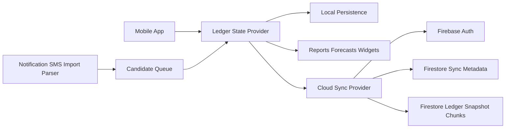

# Technical Architecture

## Stack decision

Current and recommended stack:

- Mobile app: React Native with Expo development builds
- Shared language: TypeScript
- Current data path: local-first ledger packages and local persistence
- Backend path: Firebase Auth with Google sign-in, Firestore sync metadata, and chunked Firestore ledger snapshots
- State and data fetching: React provider/local persistence, with a cloud sync provider that restores/uploads validated ledger archives
- Validation: Zod shared across client and server

The mobile app remains local-first: screens read and write the device ledger, not Firestore directly. Firebase is the production sync and restore layer, with cloud operations kept behind a central sync provider so offline use stays fast and predictable.

## Why this stack

### React Native over Flutter

Choose React Native because the current product priority is cross-platform mobile delivery with shared TypeScript business logic.

Why:

- Shared TypeScript domain logic across app and packages
- Easier reuse of validation, business logic, and reporting models
- Strong ecosystem for forms, charts, auth, and mobile app surfaces
- Android-specific native integrations remain possible when needed

Choose Flutter only if:

- You want a single UI layer more than the current Expo/React Native ecosystem
- You are comfortable investing in Dart across the whole stack

### Firebase as the production sync layer

Use Firebase for the mobile backend because the current priority is Google sign-in, restore on a new phone, and low-friction Android delivery.

Rules for this product shape:

- Keep the ledger local-first; do not query Firebase from every screen
- Store the validated ledger archive as chunked Firestore snapshot documents so the first sync slice works on Firebase Spark
- Save a local pre-restore backup before cloud data replaces device data
- Treat full entity-level merge as a later phase once the snapshot sync foundation is stable
- Keep Supabase/Postgres docs as a possible analytics/reference backend, not the current runtime backend

## Platform constraints

### iOS

- Do not design around inbox-style SMS access on iPhone
- Use manual entry, CSV imports, bank statement imports, email parsing, and shared logic instead
- Ship native updates through TestFlight/App Store metadata and reserve OTA for JavaScript/assets-only changes

### Android

- Start with notification-based capture and import-based capture
- Treat SMS parsing as optional and validate current Play policy before shipping it broadly
- APK in-app updates can be downloaded and verified by the app, but installation still requires the Android system installer confirmation
- Even when automated capture is enabled, route low-confidence matches into a review queue
- Match SMS, email, and notification transactions through safe account hints: last 4 digits, UPI IDs, sender IDs, email domains, and institution aliases; never require or store full card/account numbers
- Keep region-specific parser rules modular. The first ruleset should cover common Indian INR alerts and UK GBP card/account alerts, with ambiguous matches staying in review

## High-level architecture



## Monorepo layout

```text
apps/
  mobile/
packages/
  config/
  ui/
  domain/
  ledger/
  state/
  validation/
```

## Core services

- Domain package: money math, supported currency catalog, shared types
- Ledger package: accounts, balances, transactions, imports, capture parsing, loans, future rules, and service-level invariants
- State package: React provider, local persistence, mutation API, exchange-rate refresh bridge
- FX service: enabled currencies, `frankfurter.app` refresh, manual overrides, one-hour stale-rate warnings, safe base-currency rebasing, and non-destructive display-currency conversion
- Ingestion service: imports, parsers, candidate queue, duplicate detection, account hints, and review flow
- Insight service: dashboards, widgets, cash flow, debt, and goal progress
- Firebase services: Google auth, Firestore sync metadata, Firestore archive chunks, and user-scoped security rules

## Core data model

### User and profile

- users
- profiles
- user_preferences

### Money system

- accounts
- account_snapshots
- transactions
- transaction_splits
- currencies
- exchange_rates
- merchants
- categories
- category_rules

### Planning system

- budgets
- budget_periods
- goals
- goal_contributions
- recurring_templates
- reminders

### Liability system

- credit_cards
- card_statements
- loans
- loan_payment_schedule
- debt_priority_plans

### Automation system

- import_sources
- imported_files
- capture_candidates
- candidate_matches
- parser_rules
- review_actions

## Recommended rules for ledger correctness

- Transfers must create two linked ledger entries or one typed transfer with source and destination accounts
- Credit card payment must never count as expense twice
- Loan principal and loan interest should be separable for reporting
- Opening balance should be represented explicitly, not hidden as a normal transaction
- Every automated transaction should preserve source metadata for auditability

## Sync and offline strategy

- Mobile should keep a local cache of recent transactions and account state
- Writes should be queued locally if the device is offline
- Screens should use the local ledger provider; Firebase sync runs centrally and periodically
- On login, cloud data wins when a cloud snapshot already exists, after saving a local pre-restore backup
- When cloud is empty and the device has ledger data, upload the device ledger as the initial cloud snapshot
- Conflict resolution should prefer explicit user edits over auto-imported candidates
- Reconciliation screens should help repair drift when balances do not match

## Security baseline

- Encrypt tokens and sensitive local storage
- Support biometric or device-lock gate for app open
- Minimize raw message storage if parsing notifications or SMS
- Make export and delete-account flows explicit
- Keep audit metadata for automated imports and rule-based changes

## Suggested technical phases

### Phase 1: Stable ledger

- Auth
- Accounts
- Transactions
- Categories
- Transfers
- Dashboard

### Phase 2: Planning

- Budgets
- Goals
- Credit cards
- Loans and EMIs
- Forecasting

### Phase 3: Automation

- Notification parsing
- CSV and statement imports
- Rules engine
- Review queue

### Phase 4: Mobile hardening and reporting

- Deeper mobile reports
- Import center polish
- Review and reconciliation workflows
- Settings and maintenance tools
